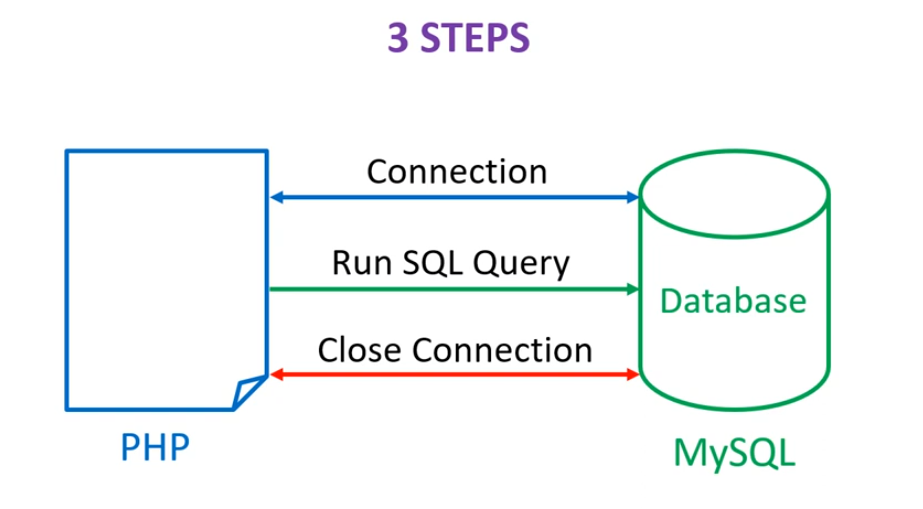

## PHP & MySQL
PHP offer a MySQLi extension for interact with MySQL database. It offers both an object-oriented and a procedural interface.

How to connect between PHP & MySQL 


## MySQLi Fetch functions
* `mysqli_fetch_array($result, $resulttype = MYSQLI_BOTH or MYSQLI_ASSOC or MYSQLI_NUM)`
Fetches a row from the result set as an associative array, a numeric array, or both.

* `mysqli_fetch_assoc($result)` 
Fetches a row from the result set as an associative array.

* `mysqli_fetch_row($result)`
Fetches a row from the result set as a numeric array.

* `mysqli_fetch_object($result)`
Fetches a row from the result set as an object.

* `mysqli_fetch_all($result, $resulttype = MYSQLI_NUM or MYSQLI_ASSOC or MYSQLI_BOTH)`
Fetches all rows from the result set as an array of associative arrays, numeric arrays, or objects.

## MySQLi error functions 
* `mysqli_connect_error()`

* `mysqli_connect_errorno()`

* `mysqli_error()`

* `mysqli_error_list()`

## What is MySQLi procedural, MySQLi object-oriented & PDO
* What is MySQLi procedural?
> MySQLi (MySQL Improved) is a PHP extension that provides an interface to the MySQL database. It offers both an object-oriented and a procedural interface for interacting with MySQL databases.

* Example of MySQLi procedural
```php
// Connect to MySQL database
$conn = mysqli_connect("localhost", "username", "password", "database");

// Check connection
if (!$conn) {
    die("Connection failed: " . mysqli_connect_error());
}

// Perform a query
$result = mysqli_query($conn, "SELECT * FROM users");

// Check if query was successful
if ($result) {
    // Fetch data from result set
    while ($row = mysqli_fetch_assoc($result)) {
        echo "Name: " . $row["name"] . "<br>";
    }
} else {
    echo "Error executing query: " . mysqli_error($conn);
}

// Close connection
mysqli_close($conn);
```

* What is MySQLi object-oriented
> MySQLi object-oriented style refers to the usage of MySQLi classes and objects to perform database operations.

* Example of MySQLi object-oriented
```php
// Create a MySQLi object
$conn = new mysqli("localhost", "username", "password", "database");

// Check connection
if ($conn->connect_error) {
    die("Connection failed: " . $conn->connect_error);
}

// Perform a query
$result = $conn->query("SELECT * FROM users");

// Check if query was successful
if ($result) {
    // Fetch data from result set
    while ($row = $result->fetch_assoc()) {
        echo "Name: " . $row["name"] . "<br>";
    }
} else {
    echo "Error executing query: " . $conn->error;
}

// Close connection
$conn->close();
```

* What is PDO?
> PDO stands for "PHP Data Objects." It is an extension in PHP that provides a consistent interface for accessing databases. PDO is a database abstraction layer that allows to interact with any kind of Database Management System.  

* Example of PDO
```php
// Database connection information
$dsn = 'mysql:host=localhost;dbname=mydatabase';
$username = 'username';
$password = 'password';

// Create a PDO object
try {
    $pdo = new PDO($dsn, $username, $password);
    $pdo->setAttribute(PDO::ATTR_ERRMODE, PDO::ERRMODE_EXCEPTION);
} catch (PDOException $e) {
    die("Connection failed: " . $e->getMessage());
}

// Perform a query
$query = "SELECT * FROM users";
$stmt = $pdo->query($query);

// Fetch data from result set
while ($row = $stmt->fetch(PDO::FETCH_ASSOC)) {
    echo "Name: " . $row['name'] . "<br>";
}

// Close connection
$pdo = null;
```